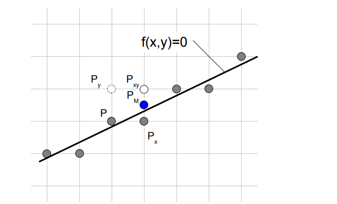

# 简单的基于 SDL 游戏引擎
## SDL 库

## C++ 模板
1. 变长参数模板  
    通过形如 `template <typename... Ts> class Magic{};` 的形式来声明一个变长参数模板。这个模板可以支持 0 ~ N 个变长参数。
    如果希望支持至少一个参数，可以使用 `template <typename T, typename... Ts> class Magic{};` 的写法。
2. 同样的，可以在函数中使用上述的变长参数模板。  
   例如，对于 `printf` 函数可以写出一个类型安全版  
   ```C++
   template <typename... Ts>
   void prinft(std::string& Str, Ts.. Args);
   ```
3. 如何解包  
   可以使用 `sizeof...(Args)` 来计算可变参数的长度  
   ```C++
   template <typename... Ts>
   void Magic(Ts... Args) {
       std::cout << sizeof...(Args) << std::endl;
   }
   ```
   递归模板参数  
   ```C++
   // 类似与递归函数的结束条件
   // 为什么不能在一个函数中完成
   // 因为我们需要判断是否有结束条件产生, 这个判断是 sizeof...(Args) 是否大于0
   // 而在下述函数中, 对于 C++11 我们没有办法通过 if 来判断这个条件(因为是编译期)
   // 所以只能通过增加一个没有变长参数包的函数作为结束条件
   // 否则这个递归将会一直调用
   template <typename T0>
   void printf(T0 Value) {
       std::cout << Value << std::endl;
   }
   
   template <typename T, typename... Ts>
   void printf(T Value, Ts... Args) {
       std::cout << Value << " , ";
       // 这里需要把参数包传递过去
       printf(Args...);
   }
   ``` 
   C++17 提供了变参模板展开的支持，可以在一个模板函数中完成展开
   ```C++
   template <typename T, typename... Ts>
   void Printf(T Value, Ts... Args) {
       std::cout << Value << ", ";
       if constexpr ( sizeof...(Value) > 0) {
           Printf(Args...);
       }else {
           std::cout << std::endl;
       }    
   }
   ```
4. `std::make_index_sequence`  
   简单来说，就是可以在编译期构造出 N 个 `size_t` 元素，例如
   ```C++
   // 这里 std::index_sequence 只是用来接受 std::make_index_sequence 参数
   // 实际的 N... 已经构造出来了
   template <size_t N>
   void PrintfIndexSequence(std::index_sequence<N...>) {
       Printf(N...);
   }
   
   int main() {
       // Output: 0, 1, 2, ... , 10
       PrintfIndexSequence(std::make_index_sequence<10>());
   }
   ```
   这里会用到模板的非类型形参，对于非类型形参，编译器会当作一个编译期常量来处理  
   这个常量只适用于模板内部  
   形参类型只能是 *整数 指针 引用*，除此之外都无法适用。
   非类型形参也可以支持可变
   ```c++
   template <typename T, T... Ins> class TestClass {
   public:
        void Test() {
             std::cout << "In TestCLass Func Test = ";
             Printf2(Ins...);
        }
   };
   int main() {
       TestClass<int, 10, 9, 8, 7, 6, 5, 4, 3, 2, 1, 0> a;
       a.Test();    // Output = 10, 9, ..., 0
   }
   ```
   在使用非类型参数模版的时候，对于指针和引用需要指向外部链接对象，否则将会不被编译通过
   ```c++
   // in Startup.h
   extern double PI;
   
   // in Startup.cpp
   template <double& Value>
   double Process(const double& InValue) {
       return InValue + Value;
   }
   
   template <double& Value> 
   double Process(const double& InValue) {
       return InValue + (*Value);
   }
    
   double PI = 3.141592653;
   
   int main() {
       std::cout << Process<PI>(1.0) << std::endl;
       std::cout << Process<&PI>(1.0) << std::endl;
   }
   ```

   那么如何实现一个 `std::make_index_sequence` 呢？  
   继承的方式
   ```c++
   // 这里的目的只是为了提出 N... 
   // 这个结构体并没有其他意义
   template <typename... N>
   struct IndexSequence{};
   
   // 这里用继承来实现序列生成
   // 假设输入 N = 3
   // 第一次： N = 3, M = 空 => 3 - 1, 3 - 1, 空
   // 第二次： N = 2, M = 2(注意此时 M 保存了一个 2 序列, 因为他把上一次的 N - 1, M... 作为传入的参数包) => 2 - 1， 2 - 1， 2
   // 第三次： N = 1, M = 1, 2 (原因同上，将第一次传入的 3 - 1， 和第二次传入的 2 - 1加入。为什么是 1, 2 呢？ 是因为他将 (N - 1, M...) 作为参数包，顺序就是小的在前) => 1 - 1， 1 - 1， (1, 2)
   // 第四次： N = 0, M = 0, 1, 2 继承到第三个结构，就可以通过 IndexSequence 取出 M...
   template <int N, int... M>
   struct MakeIndexSequence : public MakeIndexSequence<N - 1, N - 1, M...>{};
   
   template <int... M>
   struct MakeIndexSequence<0, M...> : public IndexSequence<M...>{};
   ```

   一个简单的例子 使用 `std::make_index_sequence` 实现 `std::apply`
   ```c++
   template <typename Tuple, typename Func, size_t... N>
   void FunCallTuple(const Tuple& tuple, Func&& Function, std::index_sequence<N...>) {
       // 用到了逗号运算符，会返回逗号后面的数值
       static_cast<void>(std::initializer_list<int>{ (Function(std::get<N>(tuple)), 0)... });
   }

   template <typename... Args, typename Function>
   void TravelTuple(const std::tuple<Args...>& InTuple, Function&& Lambda) {
       // 这里的 Args 也只是为了提取 tuple 的参数， 用于 index_sequence 生成遍历序列
       // 从这里可以看出 使用 ...Args 来获取参数的技巧很常见
       FunCallTuple(InTuple, std::forward<Function>(Lambda), std::make_index_sequence<sizeof...(Args)>());
   }
   ```
   
   如果对于模板参数传入的是一个 `lambda` 表达式，这个表达式需要有一个返回值，那么这个表达式将会被执行
   ```c++
   template <typename T>
   void TestFunc(T t) {}
   
   int main() {
   TestFunc([]{
        std::cout << "Run Lambda" << std::endl;
        return 1;
    }());   // Run Here 
   }
   ```
   
   如何判断类中是否存在某个成员变量
   1. 通过作用域分辨符可以直接访问到类成员(当父类和子类拥有同名成员变量时，如何区分)
   ```c++
   class Parent{
   public:
        int X;
   };
   
   class Child : public Parent{
   public:
       Child(int InA, int InB) { Child::X = InA; Parent::X = InB; }
   
       void Debug() {
           std::cout << "Child X = " << Child::X << std::endl;
           std::cout << "Parent X = " << Parent::X << std::endl;
        }
   public:
       int X;
   };

   
   int main() {
        Child CCC(1, 2);
        CCC.Debug();
        // Output : Child X = 1, Parent X = 2
   }
   ```
   2. 判断是否拥有某个成员变量的关键是理解 SFINAE(Subsititution Failure Is Not An Error 替换失败并非错误)。
   就是如果存在两个重载泛型函数 C++ 会选择能够被编译通过的函数来实例化 调用  
   下面写一个简单的例子
   ```c++
   class TValue {
   public:
    int X;
   };
   
   class BValue {
   public:
    int X;
   };
   
   class CValue : public BValue, public TValue{};
   
   template <class U, U> struct Check{};
   
   // 当多继承的两个类拥有同名同类型的成员变量时
   // &U::X 会产生编译错误的问题，因为有了二义性
   
   template <class U> void CheckFunc(Check<int BValue::*, &U::X>*) {
   std::cout << "no X value" << std::endl;
   }

   template <class U> void CheckFunc(...) { 
   std::cout << "has X value" << std::endl; 
   }
   ```
   3. 使用 `std::declval()` 函数，用于返回一个对象的引用，不论这个对象是否可以被实例化
   ```c++
   // 这里也用到了 替换失败并非错误
   // 当需要对比的类型中不含有这个成员
   // 那么第一个 Check C++ 不会编译而是选择第二个重载函数
   template <typename T> struct HasMemberF1{
   private:
   template<typename U>
   static auto Check(int) -> decltype( std::declval<U>().f1(), std::true_type() );
   template<typename U>
   static std::false_type Check(...);
   
   public:
   enum { Value = std::is_same<decltype(Check<T>(0)), std::true_type>::value };
   };
   ```
   
## C++ 对象模型
1. 抽象数据类型 ADT (abstract data type)
   借助 `class` 我们可以实现一个十分通用的 `point`
   它将 坐标类型 和 坐标数量 都进行了参数化
   ```c++
   template <typename T, std::size_t N>
   class FPoint{
   private:
        // 需要把 ...Args 这种参数包放在函数末尾
        template<typename ...Args, typename Function> void UnPack(Function Lambda, T Value, Args... Values)
        {
            if constexpr(sizeof...(Values) > 0) {
                UnPack(Lambda, Values...);
            }
            Lambda(Value);
        };
   public:
        FPoint() {
            for(unsigned int Index = 0; Index < N; ++Index) {
                Coords[Index] = 0;
            }
        }
        explicit FPoint(T InCoords[N]) {
            for(unsigned int Index = 0; Index < N; ++Index) {
                Coords[Index] = InCoords[Index];
            }
        }
        
        // 这里的关键是如何解包
        // 我使用了一个不太优雅的方式解决了
        // 可能还有更好的 待续
       template<typename ...Args>
       explicit FPoint(Args... InArgs) {
           static_assert(sizeof...(InArgs) == N);
           unsigned int Index = 0;
           UnPack([&](auto Value){
               Coords[Index] = Value;
               ++Index;
           }, InArgs...);
       }
   
   public:
        T& operator[] (std::size_t Index) {
            assert(Index < N && "Invalid Index");
            return Coords[Index];
        }
   
       T operator[] (std::size_t Index) const {
           assert(Index < N && "Invalid Index");
           return Coords[Index];
       }
   
   private:
        T Coords[N];
   };
   
   template<typename T, std::size_t N>
   std::ostream& operator<< (std::ostream& OS, const FPoint<T, N>& Point) {
        OS << "(";
        for (std::size_t Index = 0; Index < N - 1; ++Index) {
            OS << Point[Index];
            OS << ",";
        }
        OS << Point[N - 1];
        OS << ")";
        return OS;
   }
   
   int main() {
        FPoint<float, 3> Location(3.0f, 1.0f, 0.5f);
        std::cout << Location << std::endl;
   }
   ```
2. 每个 `non-inline member function` 只会诞生一个函数实例 每个 `inline function` 都会在每一个类实例上产生一个函数实例
   C++ 在布局以及存取时间上的主要额外负担是由 `virual` 引起的
   - `virual function` 运行期绑定
   - `virual base class` 多继承体系
3. `dynamic_cast<typename*>(void*)` 用来进行子类向父类转换 这是一个运行时的操作
4. `Cast` 只影响 "被指出之内存的大小和其内容"的 解释方式
5. 如果`class A` 内含一个或一个以上的 `member class objects`，那么 `class A` 的每一个 `constructor` 必须调用每一个 `member classes` 的 `default constructor`  
   如果程序员提供的构造函数不包含某些类成员初始化 那么编译器会扩张这个构造函数以满足每一个类成员都被调用默认构造函数  
   指针不在这个条件内 所以类中指针需要被显式初始化  
   类成员初始化顺序 是按照类成员在类中的声明顺序来初始化的 即使在构造中使用`Construct() : MemClass()` 也是按照声明顺序的  
   如果存在继承关系 子类没有默认构造函数 那么将会合成一个默认构造 调用父类的构造
6. 当存在 `virual function` 时 会发生一下两种扩张
   1. `virual function table` 会产生 即`vtbl` 用来放置 `virual function` 地址
   2. `vptr` 指针成员 用来指向类 `virual function table` 地址
   因此在初始化时 编译器需要为 `vptr` 指定初始值
7. 什么是 `virual base class`?  
   当需要多重继承时 B, C 同时继承于 D, 然后 A 继承 B, C  
   对于非 `virual base class` 相当于 A 继承了两遍 D, 这会造成定义模糊  
   解决方法是 对于 D, 写成 `virual base class` => ```class B : public virual C```  
   但是这同时引入了一个问题 无法在编译期决定 `virual base class` 某个成员的位置 例如
   ```c++
   class X { public: int x; };
   class A : public virual X { public: int a; };
   class B : public virual X { public: int b; };
   class C : public A, public B { public: int c; }
   
   void Foo(const A* pa) { std::cout <<  pa -> x << std::endl; }
   
   int main() {
      Foo(new A());
      Foo(new C());
   
      return 0;
   }
   ```
   因此引入了一个指针 指向这个 `virual base class`   
   这个指针是由编译器需要的 所以编译器会合成默认构造函数
8. 什么时候需要 `copy construct` ？
   1. 显式将一个类实例作为另一个类实例的初始化操作 (X a = b; )
   2. 作为函数参数传入
   3. 作为函数返回传出

9. 当没有提供 explicit copy construct 时会发生什么？  
    `default member wise initialization`  
    将每一个内建或者派生的 data member (例如指针 数组) 复制到这个类上，但是对于 member class object 将会递归的使用 `default member wise initialization`  
    - 这里要注意 对于指针对象 这种行为只是简单复制了一个指针地址到类中 并没有为这个指针开辟新的空间 所以当需要释放指针指向空间时 将会发生释放同一片地址多次的错误
10. 什么时候编译器会为 object 生成一个 copy construct?  
   简而言之 编译器会在需要的时候为其合成 copy construct.只有当类*没有*展现出 `bitwise copy semantics` 时才会合成 copy construct  
   类似 default construct, 有4种情况不会产生 `bitwise copy semantics`
    1. 当 class 含有的 member object 拥有一个 copy construct (不论是 explicit 还是编译器合成的)时
    2. 当 class 继承自一个拥有 copy construct 的 base class 时
    3. 当 class 拥有 virtual functions 时
    4. 当 class 的继承链有 virtual base class 时
11. 当 class 拥有 virtual functions 时
   如果类相同 就不需要修改 virtual functions table 指针，只需要直接复制，满足 `bitwise copy samantics`，所以编译器不会合成
   如果时 derived class object 和 base class object，那么就需要重新修改指针，此时编译器会为 class object 合成 copy construct
12. virtual base class subobject
   

## CMakeLists 笔记
1. `include_directories(${PATH_NAME})` 用来指定目录下头文件路径
2. `add_library(${PROJECT_NAME} ${ALL_SOURCES} ${ALL_INCLUDES})` 用于生成动态库
3. `target_include_directories(${PROJECT_NAME} INTERFACE ${PATH_NAME})` 外部引用动态库时，可以通过此方法指定动态库的头文件路径，需要在 `add_library` 之后
4. `target_link_libraries(${PROJECT_NAME} ${LIB_NAME})` 用来指定链接库，输入名字，需要在 `add_executable` 之后 
5. `warning C4819: 该文件包含不能在当前代码页(936)中表示的字符` 可以在 CMAKE 中加入 
    ```C++
        if (MSVC)
            # 设置 msvc 输入代码编码格式为 utf-8
            set(CMAKE_C_FLAGS /source-charset:utf-8)
        endif()
    ```
6. .gitgnore 文件更新
   ```git
   git rm -r --cached .
   git add .
   git commit -m 'update .gitignore'
   git push -u origin master
   ```
7. `std::enable_shared_from_this` 如果父子类都需要这个特性，那么只需要在父类中继承这个类就可以了。在子类中可以通过 `std::static_ptr_cast<>` 方法来转换到子类的 `shared_ptr`
   ```C++
   class A : public std::enable_shared_from_this<A>
    {
    };

    class B : public A
    {
    public:
        void Test(const std::shared_ptr<B> &Parent)
        {
            if (Parent == std::static_pointer_cast<B>(shared_from_this()))
            {
                printf("Parent == This\n");
                return;
            }
            printf("Parent != This\n");
        }
    };

    int main(int argc, char **args)
    {
        auto b = std::make_shared<B>();
        auto testB = std::make_shared<B>();
        b->Test(b);     // Output : Parent == This
        b->Test(testB); // Output : Parent != This

        return 0;
    }
   ```
## 图形学
1. 画线算法
    1. 中点画线算法  
       
    